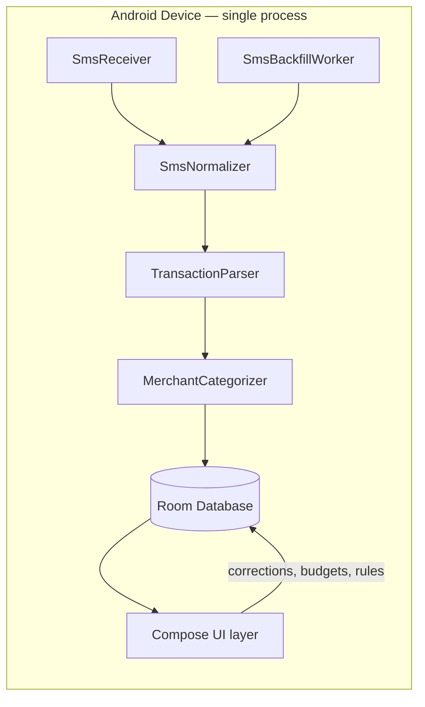

# System Architecture — Expense Tracker

## Purpose and authority

This document defines the shared, cross-cutting contracts for Expense Tracker: an Android-only, fully offline xpense tracker that derives transactions from device SMS. Any contract defined here binds every blueprint listed in [blueprints/README.md](blueprints/README.md). Where this document and a blueprint disagree, this document wins for shared contracts; the blueprint wins for responsibility-local detail. Verified code and passing GitHub Actions runs are authoritative over prose in this file; label unverified claims explicitly rather than asserting them as fact.

## System boundaries

Expense Tracker is a single Android application, package `dev.xpensetracker.app`, built with Kotlin, Jetpack Compose, and Room. It runs entirely on-device:

- **In scope:** reading inbound and historical SMS on the device, parsing bank/UPI/wallet transaction messages, storing structured transactions locally, categorizing by merchant, and presenting spend analytics and budgets in a Compose UI.
- **Out of scope (v1):** any network call, any backend service, cloud sync or backup, multi-device sync, user accounts/login, push notifications, and iOS support (SMS APIs used here do not exist on iOS).
- **External actors:** the Android SMS provider (`content://sms`, `SMS_RECEIVED` broadcast), the device's telephony subsystem, and the user via the Compose UI. There is no server-side actor.

## Component model

Dependency direction is one-way: ingestion (`Receiver`, `Backfill`) depends on nothing else in the app; `Normalizer` and `Parser` depend only on Android SMS/telephony APIs and plain Kotlin, never on Room or Compose; `Categorizer` depends on `Parser` output and Room-persisted rules; `Repo` (Room) depends on nothing above it; `UI` depends on `Repo` and exposes user actions that flow back into `Repo` only, never directly into `Parser` or ingestion. This keeps the parsing and categorization logic independently unit-testable under JVM/Robolectric tests with no Android instrumentation required.

Ownership:
- **Ingestion** (`blueprints/sms-ingestion.md`) owns `SmsReceiver`, the backfill `WorkManager` job, the sender allowlist, and content-hash dedupe.
- **Parsing** (`blueprints/transaction-parsing.md`) owns the JSON rule assets, the regex/template engine, and confidence scoring.
- **Categorization** (`blueprints/merchant-categorization.md`) owns merchant-to-category mapping, user overrides, and the needs-review queue.
- **Persistence** (`blueprints/local-persistence.md`) owns the Room schema, DAOs, migrations, and the `categories` table that defines the category set.
- **Analytics** (`blueprints/spend-analytics-and-budgets.md`) owns spend aggregation, the spend ring, category donut, and budgets.
- **Design system & navigation** (`blueprints/design-system-and-navigation.md`) owns theme, typography, shape/spacing tokens, the four-destination navigation shell, the month filter shared by Home and Spends, and the detail routes layered on that shell (transaction detail, needs-review queue, category management).
- **Onboarding** (`blueprints/permissions-and-onboarding.md`) owns permission requests and first-run explanation.
- **Build & CI** (`blueprints/build-and-ci.md`) owns the Gradle toolchain and GitHub Actions workflows.

## Shared contracts

### Identity and ownership

- A transaction's identity is a stable `contentHash`: a SHA-256 hash of the normalized SMS sender + normalized body + received timestamp truncated to the minute. `contentHash` is the Room primary key surrogate's uniqueness constraint (`sms_hashes.content_hash`, unique index) and is the sole de-duplication mechanism across the live receiver and the backfill worker. The same SMS processed twice (e.g., received live, then re-seen during a backfill) MUST resolve to the same `contentHash` and MUST NOT create a duplicate transaction row.
- Raw SMS body text is never persisted beyond the immediate parsing pass in memory. Only `content_hash`, and the fields the parser extracts (amount, direction, merchant text, account tail, reference, balance, timestamp), are written to Room. This is a privacy invariant, not an optimization; see Error and recovery for the consequence when parsing fails.
- Accounts are identified by `accountTail` (last 4 characters as they appear in the SMS, e.g. `xx5800`) plus issuer name; there is no bank API integration to resolve a canonical account ID, so `(issuer, accountTail)` is the account identity tuple. Two different physical accounts that happen to collide on this tuple are a known, accepted limitation (see gaps in `blueprints/local-persistence.md`).
- Categories and merchant rules are user-owned and locally mutable at any time; a category rename or merchant-rule edit re-applies only forward (new transactions), never rewrites historical transactions' stored category, to keep month-over-month history stable. Historical re-categorization is an explicit user action, not an automatic side effect.

### State lifecycle

- Every parsed SMS produces exactly one `Transaction` row in one of three states: `CONFIRMED` (parser confidence at or above threshold and a known merchant rule matched), `NEEDS_REVIEW` (parser confidence below threshold, or no merchant rule matched, or ambiguous transaction direction), or `IGNORED` (message matched an allowlisted sender but was not a transaction, e.g., an OTP or promotional message from a bank sender).
- Transitions: `NEEDS_REVIEW → CONFIRMED` happens only via explicit user confirmation/edit in the UI. `CONFIRMED` transactions can be edited by the user at any time, which does not change state but does record that the row is user-modified (`is_user_edited` flag) so future parser re-runs never silently overwrite it.
- The needs-review queue is exactly the set of transactions in `NEEDS_REVIEW` state; it is a query, not a separate store.
- Budgets are scoped to a calendar month (device-local time zone) and a category; a budget has no state machine beyond existing or not existing for a given `(month, category)` pair.

### Data representation

- All monetary amounts are stored and computed as `Long` integer minor units (paise for INR) — never `Double`/`Float` — to avoid rounding drift in aggregation. UI formatting converts minor units to the displayed rupee string only at render time.
- Timestamps are stored as UTC epoch milliseconds (`Long`). Month-boundary logic (e.g., "September spends") always converts to the device's current default `ZoneId` before bucketing; the boundary contract lives here so analytics and transaction-list filtering can never disagree on what "this month" means.
- Transaction direction is a two-value enum, `DEBIT` or `CREDIT`; "Spends" aggregates `DEBIT` only, "Income" aggregates `CREDIT` only, matching the reference UI's Spends/Income split. The parser's reading of direction is a default the user may overrule on a single transaction, because direction decides which total an amount lands in and a misread credit silently inflates spends. Like a category correction the override is row-scoped and forward-only (it sets `is_user_edited` and rewrites nothing else), but unlike a category correction it is never generalized into a merchant rule: one salary credit from a sender says nothing about the next message from it.
- A spend category is a **row in the `categories` table**, not a compile-time enum. Its identity is a stable `TEXT` id. The fourteen built-ins seeded from the reference screenshots (`INVESTMENT`, `BILLS`, `EMI`, `FOOD_AND_DRINKS`, `SHOPPING`, `GROCERIES`, `RENT`, `FUEL`, `SELF_CARE`, `TRANSFER`, `FRIENDS`, `TRAVEL`, `OTHER`, `UNKNOWN`) use those exact strings as their ids, and user-created categories use a generated `custom_<uuid>` id. `transactions.category`, `budgets.category`, and `merchant_rules.category` all store such an id as `TEXT`; they are not declared as SQL foreign keys, because cascade-on-delete would rewrite history, so referential integrity is enforced at the repository layer instead.
- Category display attributes (name, color, icon) are **row data, not code**. A category's color is stored as `colorArgb` on its row so the donut, the category list, and transaction avatars all read one value, and a user-created category is visually indistinguishable in capability from a built-in one.
- A transaction carries two optional user-authored fields that no automated path ever reads: a free-text `note`, and a `(locationLat, locationLng)` pair stored as degrees. Both are write-only from the app's perspective — the parser, the categorizer, and every aggregate ignore them — so nothing a user types or tags can change how money is counted. The coordinate pair is null together or present together; half a coordinate is not a place.
- `UNKNOWN` is the default id for anything the categorizer cannot match, distinct from `NEEDS_REVIEW` transaction state (a transaction can be `CONFIRMED` with category `UNKNOWN` if the user explicitly confirms it that way).
- **Deletion policy, derived from the forward-only rule in Identity and ownership:** a built-in category can be archived (hidden from pickers) but never deleted, so historical rows always resolve. A custom category may be hard-deleted only when no transaction, budget, or merchant rule references its id; otherwise the only available action is archive. Nothing in this contract ever bulk-rewrites a stored category id.

### Error and recovery

- Parser failures are non-fatal and non-destructive: a message that cannot be parsed as a transaction is either marked `IGNORED` (recognized non-transactional bank message) or, if it looks transactional but fields are incomplete, stored as `NEEDS_REVIEW` with whatever fields were extracted and nulls elsewhere. The app never drops a plausibly-financial SMS silently.
- Room schema changes require an explicit `Migration` object; destructive fallback (`fallbackToDestructiveMigration`) is forbidden once the app has shipped a version, because it would silently erase the user's only copy of their financial history (there is no backend to restore from). Pre-v1 schema churn may use destructive fallback and must say so in `blueprints/local-persistence.md`.
- Because there is no backend, there is no server-side recovery path. Local export/import is out of scope for v1 (per the agreed plan) and is tracked as a gap in `blueprints/local-persistence.md`, not silently assumed.
- The `SmsReceiver` and `SmsBackfillWorker` never throw across their Android entry points; all parsing/categorization exceptions are caught at the ingestion boundary and logged without message content, converting to an `IGNORED`-with-error-flag row so a single malformed SMS cannot crash ingestion for the rest of the inbox.

### Privacy and permission invariant

- The app declares `READ_SMS` and `RECEIVE_SMS` as required permissions, plus `ACCESS_COARSE_LOCATION`/`ACCESS_FINE_LOCATION` as optional ones. **The `AndroidManifest.xml` MUST NOT declare the `INTERNET` permission.** This is enforced structurally (no networking dependency is added to `app/build.gradle.kts`) and is checked by CI (`blueprints/build-and-ci.md`) via a manifest-permission assertion test.
- Location is opt-in, foreground-only, and per-transaction. It is requested the first time the user taps to tag a transaction, never at launch; a denial disables exactly that one control and nothing else. `ACCESS_BACKGROUND_LOCATION` is forbidden, and no ingestion path — neither `SmsReceiver` nor `SmsBackfillWorker` — may read a position, because a location captured without a deliberate tap would turn an xpense tracker into a movement log. The position is read from the platform `LocationManager`, not Play Services, so no closed-source location dependency enters the build.
- A stored coordinate leaves the app only through an explicit tap that hands it to the device's default map application via a `geo:` intent. That app is outside this app's trust boundary and is very likely online; the user chooses it and chooses the moment. This is the single sanctioned egress in the product, and it exists because the alternative — rendering a map in-app — would require exactly the network access this section forbids.
- No SMS body content, parsed transaction data, or derived analytics ever leaves the device: no analytics SDK, no crash reporter with network transport, no ad SDK. Any future feature that would require `INTERNET` (e.g., cloud sync) is a shared-contract change to this section, not a local blueprint edit, and requires updating this invariant explicitly and re-justifying the SMS-permission privacy story in onboarding copy.
- Because `READ_SMS` for xpense-tracking purposes is disallowed on the Google Play Store, this app targets sideload/self-build distribution only; `blueprints/permissions-and-onboarding.md` and `blueprints/build-and-ci.md` must reflect this and never introduce a Play publishing workflow without revisiting this contract.

## Cross-cutting flows

### SMS-to-transaction pipeline

`SmsReceiver` (live) or `SmsBackfillWorker` (historical inbox scan) → `SmsNormalizer` (sender allowlist filter + whitespace/encoding normalization + `contentHash` computation and dedupe check against `sms_hashes`) → `TransactionParser` (rule-based extraction + confidence score) → `MerchantCategorizer` (rule lookup, user-override lookup, else `Unknown`) → Room write (`transactions` + `sms_hashes` in one transaction) → UI observes via Room `Flow`/`LiveData` and updates Home/Spends reactively. This flow spans `sms-ingestion`, `transaction-parsing`, `merchant-categorization`, and `local-persistence`; a change to the `contentHash` algorithm or the state enum touches all four and must be reviewed as a shared-contract change.

### User-correction feedback flow

UI edit on a `NEEDS_REVIEW` or `CONFIRMED` transaction → Room update sets `is_user_edited` and, if the category changed, upserts a `merchant_rules` row keyed by normalized merchant text → future parses of the same merchant apply the learned category automatically. The same edit may also correct the transaction's direction, which changes nothing but that row and teaches nothing. This flow spans `merchant-categorization`, `local-persistence`, and the `screens` UI; it never reaches back into `transaction-parsing`, which only extracts raw fields and never assigns category.

## Verification boundaries

Because GitHub Actions is the only build and test authority (no local Gradle/emulator runs), verification is layered strictly by what runs on the JVM without an Android device:

- **Unit tests (`./gradlew test`, plain JVM):** `TransactionParser` rule evaluation against the fixture corpus, `MerchantCategorizer` rule matching, money/date utility functions. These are the fastest and most numerous tests and are required for every parser/categorizer change.
- **Robolectric tests (`./gradlew test`, Robolectric runner):** Room DAO behavior (insert/dedupe/migration), `WorkManager` worker logic, and Compose UI tests that don't need a real device. These substitute for instrumented tests since there is no emulator in CI by default.
- **Static checks:** Android Lint (`./gradlew lint`) and the manifest-permission assertion (no `INTERNET`) run on every push.
- **Build verification:** `./gradlew assembleDebug` must succeed; this is the minimum bar for "the app compiles," and no change is considered done without a green run covering it (`blueprints/build-and-ci.md`).
- Nothing above this line requires a physical device or emulator; if a future need arises for instrumented (`androidTest`) coverage, that is a shared-contract change to this section, because it changes what "verified" means for every blueprint that cites CI evidence.

## Feature blueprints

See [the blueprint manifest](blueprints/README.md).
